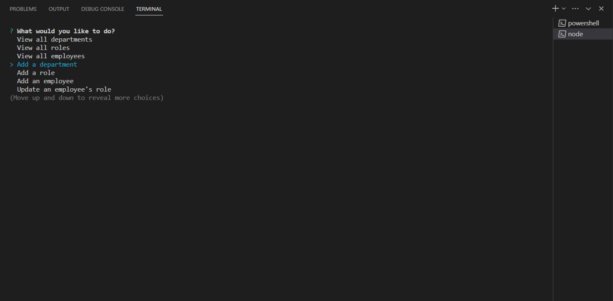
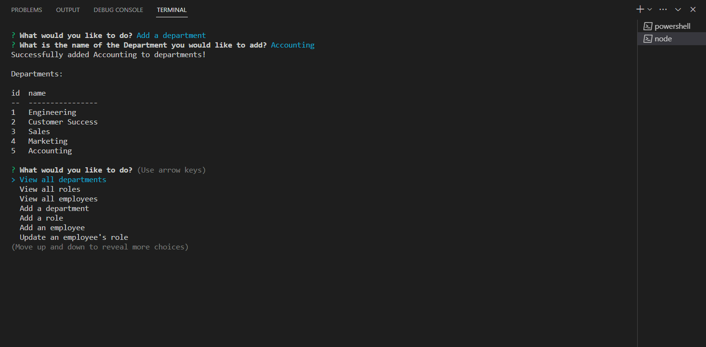

# Employee-CMS
Creates a database for managing employee information.

## Description

I built this project in order to practice using MySQL databases and queries to view, add, and edit information. It solves the problem of having to remember specific information for individual employees, as all of the departments, roles, and employees can be viewed by querying the database. I learned about MySQL queries, promise-chaining, joining tables, prepared statements, and using foreign keys to reference data from different tables.

## Table of Contents

- [Installation](#installation)
- [Usage](#usage)
- [Tests](#tests)

## Installation

You will need to install Node.js, Inquirer, and MySQL in order to use this app. 

Instructions for installating Node.js can be found here: https://coding-boot-camp.github.io/full-stack/nodejs/how-to-install-nodejs 

Instructions for installing the Inquirer package can be found here: https://www.npmjs.com/package/inquirer/v/8.2.4

Instructions for installing MySQL can be found here: https://coding-boot-camp.github.io/full-stack/mysql/mysql-installation-guide

## Usage

In order to use the application, all you will need to do is type "node index.js" into your terminal and answer the prompts.

A link to the video to showcase the functionality of the app is below.

https://drive.google.com/file/d/1NnwGKHx5wBLLrvjP1O0cv06fICjDhgOC/view

## Tests

This project can be tested by answering the prompts with different answers. You will then see that new employee information has been generated based on the new answers.
